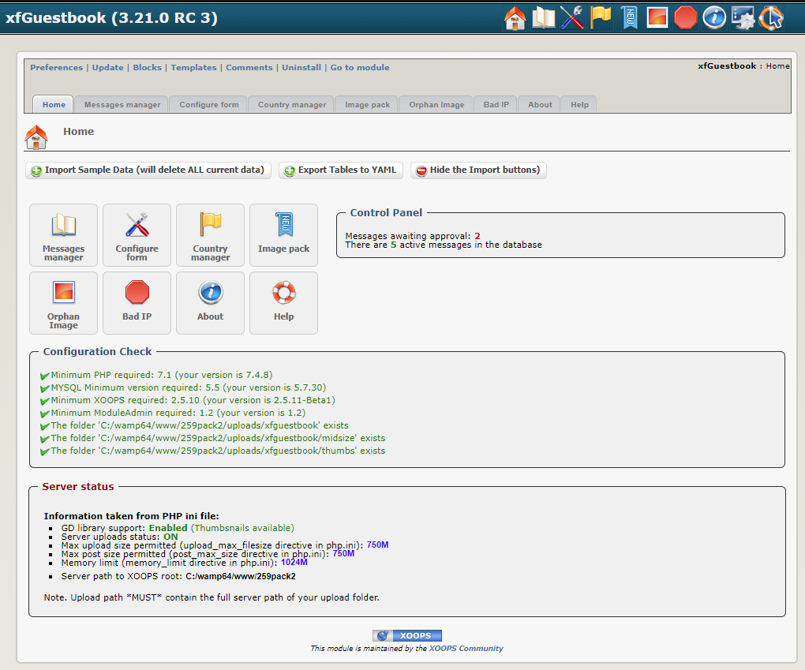
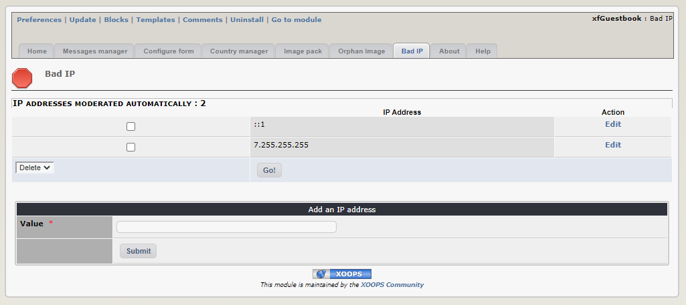
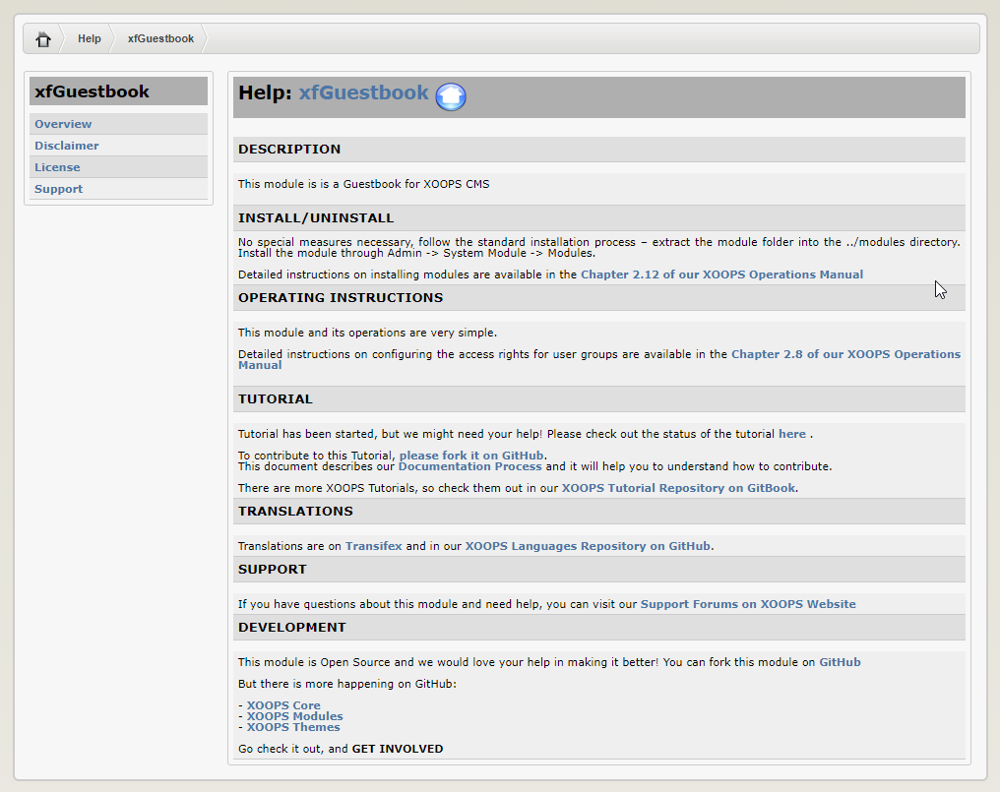

# 2.0 Administration Menu

*Figure 1: Main view of the xfGuestbook Module (Admin side)*

*Figure 2: Message Manager (Admin side)*

*Figure 3: Form Configuration  (Admin side)*

*Figure 4: Country Manager (Admin side)*

*Figure 5: Image Manager (Admin side)*

*Figure 6: Orphan Image (Admin side)*

*Figure 7: Bad IP (Admin side)*

*Figure 8: About (Admin side)*

*Figure 9: Help (Admin side)*

